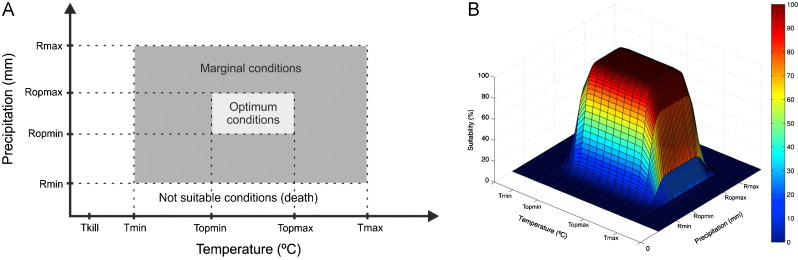

```{r setup, include=FALSE}
knitr::opts_chunk$set(echo = FALSE)
library(dismo)
source("../functions.R")
data <- normalize.data(load.data("../data/Kita", lat=13.0, lon=-9.5))
```

## Climate Corridor Approach

#### Input data

In the ClimApp, climate data downloaded from KNMI (currently CRU TS4.05 for historic data and CMIP6 for projections) is organized in the following way. 

```{r dat}
data[data$month == "Jul" & ((data$year == 2020 & is.na(data$mod)) | (data$year == 2100 & data$mod %in% c("cmip6_ssp126_000", "cmip6_ssp126_001", "cmip6_ssp585_000", "cmip6_ssp585_001"))), ] %>% arrange(var, year, desc(set), sce)
```
Variables considered are ``pre`` for precipitation (mm/day) and ``tas`` for average temperature (ºC). Scenarios are ``ssp126``, ``ssp245``, ``ssp370`` and ``ssp585``. Models is an ID for the model used. Details on individual models can be found the corresponding data files. 

The normalized value is calculated by ClimApp by applying the deviation of a model's projections $mod$ from observed values $obs$ over a given reference period $NP$ (e.g. 1991 - 2020) to all projections by that model.

$$tas_{norm,y} = tas_{mod,y} + (\overline{tas}_{obs,NP} -  \overline{tas}_{mod,NP})$$

$$pre_{norm,y} = pre_{mod,y} \cdot (\overline{tas}_{obs,NP} \mathbin{/} \overline{tas}_{mod,NP})$$

In order to calculate Climate Corridors, this climate data is handed over to a function called ``plot.corr``, together with a crop specification (see example in EcoCrop Index below) for the crop to be examined.

#### plot.ccor
```{r ccor}
plot.ccor
```

The function first converts the data into the wide format (one column for each month in the year), in order to determine for each year (seperately for observation and each projection) the n "wettest" consecutive months of the year (which is implicitly assumed to be the growing period). 

It then calculates the the average, minimum and maximum temperature and precipitation for those "wettest" n months, still, separately for each year and each observation or model projection and summarizes the values of the different models (quantiles of the distribution of the individual model projections).

The observed minimum and maximum temperature over the growing period ("wettest n months"), as well as the and the corresponding quantiles of the model projections, is then plotted against the crop's temperature requirements.

For the precipitation corridor, average precipitation over the growing period (mm/day) is first multiplied by the duration of the growing period (days) in order to obtain the total precipitation, which again is plotted against crop requirements.


## EcoCrop Index

The Ecocrop Model has initially been developed by Hijmans et al. in 2001. It evaluates for a specified crop on a monthly basis if there are adequate climatic conditions within a growing seasons for temperature and precipitation, and calculates the climatic suitability of the resulting "interaction" between rainfall and temperature.

```{r ecocrop-fig, fig.align = 'center', out.width = "100%", fig.cap = "Ecocrop Index. Figure from [Ramirez-Villegas et al. (2013)](https://www.sciencedirect.com/science/article/abs/pii/S0168192311002814)"}

```

Crop requirements used in the model are minimum and maximum growing period, optimum temperature and precipitation range, as well as marginal temperature and precipitation range, which are, per default, obtained from the [FAO Ecocrop Database](https://ecocrop.review.fao.org).

```{r crop, fig.align = 'center', out.width = "100%", fig.cap = "Default ecocrop Parameters and resulting suitabilities for Potato"}
crop <- getCrop("Potato")
crop
plot(crop)
```

The ecocrop model developed by Hijmans is available in the dismo R-package [``dismo::ecocrop``](https://search.r-project.org/CRAN/refmans/dismo/html/ecocrop.html). As parameters, the function requires ECOCROP object ``crop`` the specifies the crop requirements and vectors of monthly minimum and average temperatures (``tmin`` and ``tavg``) as well as vector of monthly precipitation ``prec``. Precipitation is ignored, if ``rainfed=FALSE`` (instead of vectors, it can also work with stacks of 12 raster layers for spatial assessments).

#### dismo::ecocrop
```{r ecocrop}
ecocrop
```

In case climate vectors presented as vectors for a specific location instead a stack of 12 raster layers, ``ecocrop`` function is calling the internal function ``.doEcocrop``, providing it with the same parameters.

#### dismo:::.doEcocrop
```{r .doEcocrop}
dismo:::.doEcocrop
```

+ It calculates the duration of the growing period in months, taking the average of the crop's minimum and the maximum growing period (``GMIN`` and ``GMAX``), dividing it by 30 days and rounding to the next integer.

+ After that, it calculates temperature suitability for each month using the internal function ``.getY``, providing the crop's temperature requirements (``TMIN``, ``TOPMIN``, ``TOPMX`` and ``TMAX``). See description of ``.getY`` below.

+ For testing wether the crop's killing temperature is reached, it takes the monthly minimum temperatures and subtracts 5ºC. 
<span style="color: red;">This indicates that the monthly minimum temperatures are the average daily minimum temperatures and not the absolute minimum.</span> 

+ Calculating precipitation suitability is somehow sophisticated. First, the algorithm sums up for each month the monthly precipitations for the duration of the growing period + one month in addition, and further adds precipitation from the previous month. For a crop with ``duration=3`` cumulative January precipitation would for example be the sum of the first for months in the year (Jan--Apr) plus precipitation from December, cumulative December precipitation would be Dec--Mar, plus November. 
<span style="color: red;">For precipitation suitability, the EcoCrop algorithm is comparing "seasonal" precipitations (incl. one month before and one after the growing period) with the crop's annual precipitation requirements as specified in the EcoCrop database crop.</span>

+ It then takes the minimum suitability (either temperature or precipitation) for each month. <span style="color: red;">At this level, we could still distinguish whether temperature or precipitation is the limiting factor.</span>

+ The algorithm then takes these monthly minimum suitabilities and assumes each month being the start of the growing period specified by ``duration``. Therefore it calculates the minimum suitability of the month incl. the following n months making up the growing period. <span style="color: red;">At this level, temperature and precipitation suitabilities might get mixed up and cannot be distinguished anymore.</span>

#### dismo:::.getY
```{r .getY}
dismo:::.getY
```

The function ``.getY`` calculates monthly suitability based on crop requirements specified in parameter ``a`` (``MIN``, ``OPMN``, ``OPMX``, ``MAX``) and the monthly values of the variable in parameter ``x``. Suitabilities are stored in the results vector ``y``.

+ If the the monthly value is below  ``MIN``, or above ``MAX``, suitability is assigned 0

+ if it is between ``OPMN`` and ``OPMX``, suitability it is assigned 1

+ if it is between ``MIN`` and ``OPMIN``, suitability is interpolated between 0 and 1 and if it is between ``OPMX`` and ``MAX``, suitability is interpolated between 1 and 0

```{r example, include=FALSE}
tmin <- 5:16
tavg <- 15:26
prec <- c(8.5, 29.7, 42.9, 47.8, 10.3, 43.3,  3.2, 77.2, 90.2, 47.0, 4.8, 98.2)
crop <- getCrop('potato')
ecocrop(crop, tmin, tavg, prec)
dismo:::.doEcocrop(crop, tmin, tavg, prec, rainfed=TRUE)
sum(is.na(c(tmin, tavg, prec)))

duration <- round((crop@GMIN + crop@GMAX)/60)
tmp <- c(crop@TMIN, crop@TOPMN, crop@TOPMX, crop@TMAX)
temp <- dismo:::.getY(tmp, tavg)
ktmp <- c(crop@KTMP, crop@KTMP, Inf, Inf)
tmin <- dismo:::.getY(ktmp, tmin - 5)
pre <- c(crop@RMIN, crop@ROPMN, crop@ROPMX, crop@RMAX)
shftprec <- c(prec[12], prec[-12])
cumprec <- movingFun(prec, n = duration + 1, fun = sum, type = "from", circular = TRUE) + shftprec
prec <- dismo:::.getY(pre, cumprec)
allv <- cbind(temp, tmin, prec)
minv <- apply(allv, 1, min)
movingFun(minv, n = duration, fun = min, type = "from", circular = TRUE)

dismo:::.getY(pre, cumprec)
a <- pre
x <- cumprec

a
x
```
